## 侃吧小程序
> Coded in 2020.05；\
> 非教程项目，从0到1，独立完成；\
> 产品设计->UI设计->前端开发->后端开发->后端部署。

### 技术栈关键词：
* 前端：原生微信小程序、es6、iconfont；
* 后端：nodejs、express、mysql、jwt、apidoc；
* 后端代码仓库(含mysql表的设计)：[https://gitee.com/ytiona/kan_bar_serve](https://gitee.com/ytiona/kan_bar_serve)

#### 前端封装：
    dropdown-menu：下拉菜单组件；
    modal：模态框组件；
    tab：标签菜单组件；
    tag：标签组件；
    list-footer：列表底部组件；
    
    request：配合后端jwt鉴权；
    LoadByPage：分页列表工具类；

### 基础内容：
* 首页：帖子推荐、签到、搜索栏等
* 找帖子：分类、标签、关键字；
* 发布帖子：发帖、求配图、找表情；
* 个人中心：个人信息、数据统计、子模块入口；
* 意见反馈
* 关于我们

### 帖子模块：
- [x] 发帖
- [x] 求配图
- [x] 找表情
- [x] 帖子搜索
- [x] 帖子标签
- [x] 帖子评论
- [x] 帖子点赞
- [x] 评论点赞
- [x] 回复评论
- [x] 评论回复详情
- [x] 评论排序
- [x] 帖子排行榜

### 社交模块：
- [x] 用户搜索
- [x] 关注用户
- [x] 我的粉丝
- [x] 个人资料
- [x] 资料编辑
- [x] 用户主页

### 积分系统：
- [x] 积分记录
- [x] 签到获取积分
- [x] 发帖获取积分
- [x] 求配图积分悬赏
- [x] 找表情积分悬赏

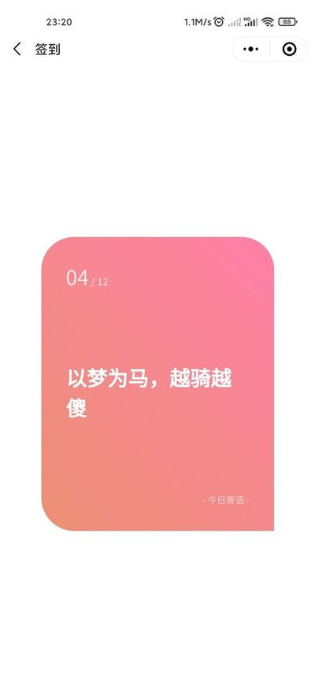

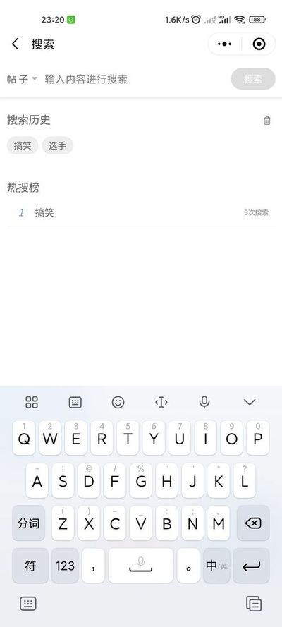
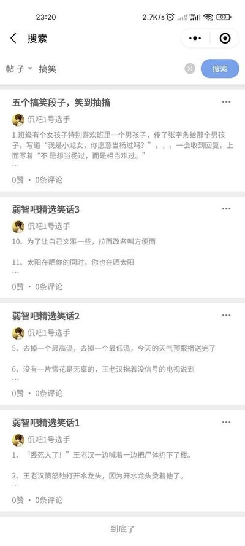

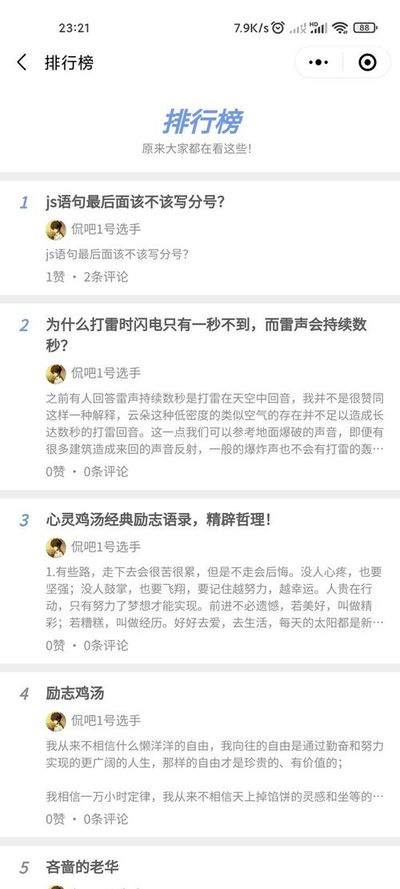
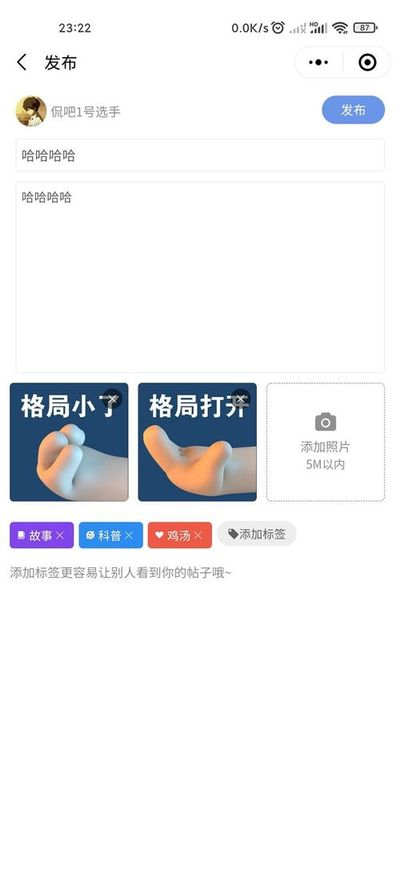

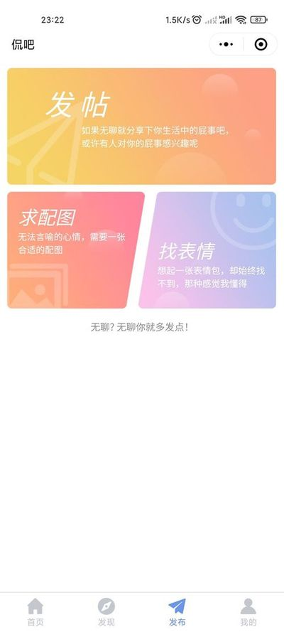

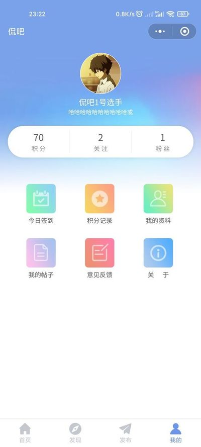

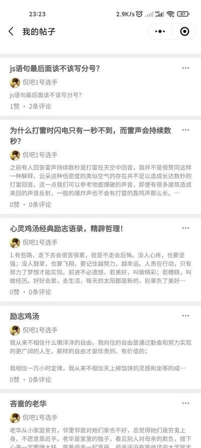
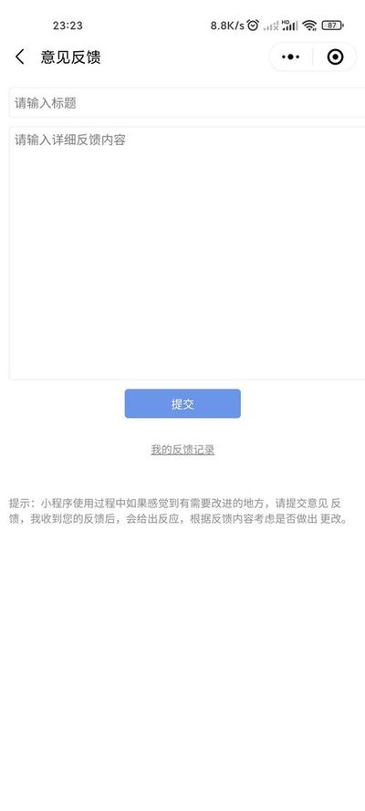

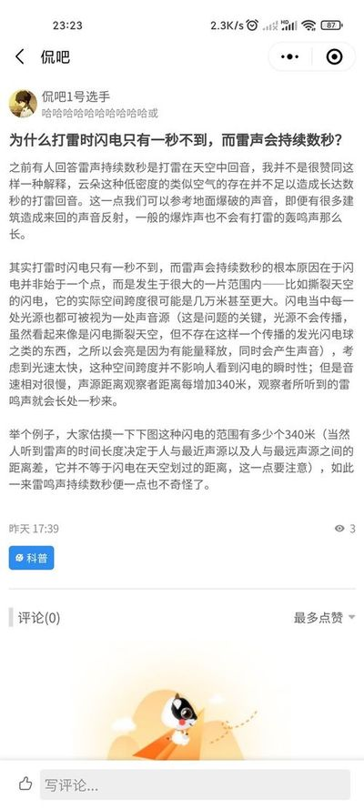

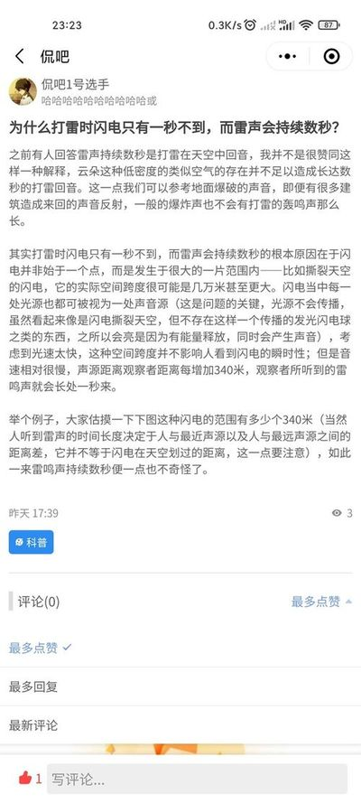
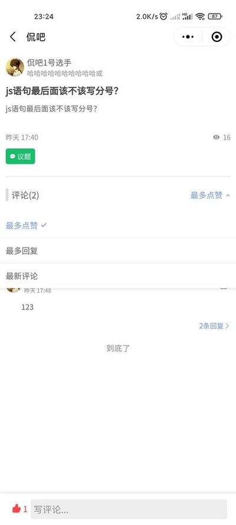

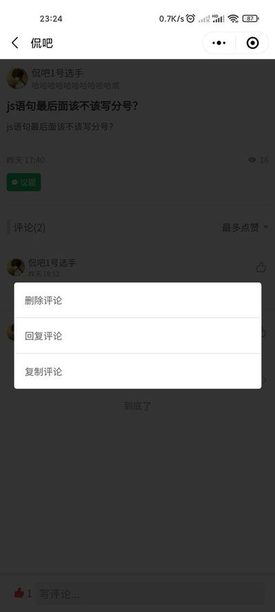
